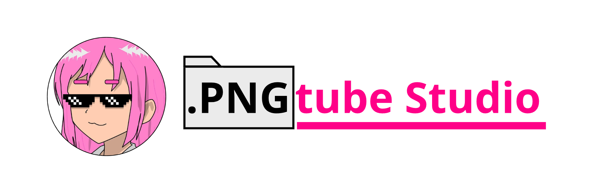

## PngtubeStudio



This project seeks to be an alternative for PNGtubers, integrating tools more dedicated to said format, seeking to be a program based on community comments.

*This project was bootstrapped with [NodeJs](https://nodejs.org), [ElectronJs](https://www.electronjs.org) and [ReactJs](https://react.dev)*

## Instalation

```bash
$ git clone -GITHUB_URL-
$ npm install
```

## Wireframes

These are the wireframes ***pending to submit***.

## Console Scripts

#### *Available Scripts: Frontend*

- **`start:app`** initialize the Electron model with the react build *(For development)*
- **`build:ui`** generates a build of the UI created with ReactJs *(Required to develop and compile)*
